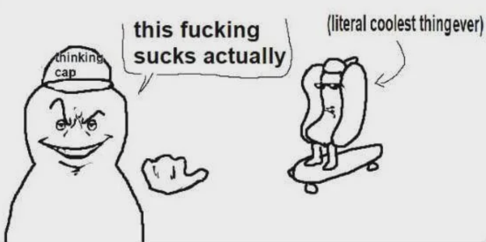

+++
title = 'Californication'
date = 2026-04-16T13:53:07Z
draft = true
+++

## Rage Against the System

In 1999, the Red Hot Chili Peppers released *Californication* — a song explicitly designed to critique the shallow, manufactured dream that Hollywood exports to the world. Kiedis watched the entertainment industry seduce entire generations with a plastic fantasy, and he was disgusted. So he did what any self-respecting rockstar-intellectual does: he wrote a song about it.

The intent was clear. This was a warning shot. A critique of the machine.

## Official Endorsement

Then something unexpected happened. Radio stations played it. Record stores sold it. MTV aired the music video on loop. The song went platinum. California, the very cultural export machine being criticized, had absolutely no problem packaging the critique and shipping it worldwide.

Kiedis was a rockstar who thought California was kind of stupid, said so loudly, and somehow ended up making everyone want to move there. He thought he was the observer. He was always already inside the phenomenon.

But this raises an uncomfortable question: *why?* What is the mechanism by which a critique of a culture becomes a vehicle for that culture's expansion? To answer that, we need to look at the structure of Californication itself.

## The Hotdog

This is the situation. California is the hotdog. Cool as fuck and completely unbothered. Kiedis thinks he's the wojak with the thinking cap, squinting critically at the phenomenon. But by creating the song (the meme) he accidentally made the hotdog look even cooler.

The critic becomes an involuntary hype man. This isn't just a quirk of this one song. It may be a fundamental architectural property of dominant culture: it converts all engagement — hostile, ironic, analytical, disgusted — into fuel. Critique it and you're just goinna give the skateboard more momentum.

Why does critique make the hotdog cooler? To answer that, we have to go back to the beginning.

## Forbidden Fruit

In Genesis, God placed two trees in the center of Eden and explicitly prohibited access to one of them. The moment God said "don't eat the fruit of Knowing Good and Evil," the fruit became the only thing worth eating. The prohibition wasn't a guardrail. It was an advertisement. The warning *generated* the desire.

This is the mechanism. Framing something as dangerous, corrupting, and irresistible doesn't diminish it. It turns it into forbidden fruit.

Consider Squid Game. The show depicted Korea as a brutal, desperate dystopia. It was not a flattering portrait. And yet it triggered a global wave of interest in Korean culture — the language, the food, the aesthetic. The warning produced the desire. Nobody watched Squid Game and thought "how terrible, I should avoid Korea." They thought "this world is fascinating and I want more of it."

Kiedis ran the same subroutine without realizing it. By framing California as dangerous, corrupting, and irresistible, he made it more seductive, not less. A forbidden hotdog. Hollywood probably owes him royalties for the advertising.

## The Three Categories of Criticism

We need to add some clarification here. What we've been saying up until now is essentially "all publicity is good publicity" but in more precise terms. But that's not strictly true. If somebody comes out against a CEO for descrimination, he doesn't say "I'm the Lebron James of racism." That wouldn't be free advertising. That would be fatal.

So what makes a critique fatal rather than aggrandizing?

The real taxonomy has three categories:

**Category one: criticism that confirms the product, disguised as a warning.** The dangerous, corrupting California. The brutal dystopian Korea. The ruthless cartoon villain CEO. The critic engages with what actually makes the thing compelling, attaches a negative valence to it, and ships it to a wider audience. Ironically, this is almost always what passionate criticism produces, because to care enough to attack something loudly, you have to reckon with what makes it powerful. You cannot warn people away from California without describing what makes it seductive.

**Category two: criticism that is genuinely irrelevant.** Bad traffic. Poor shoe taste. This produces silence. Nobody amplifies it, nobody finds it interesting, it just evaporates.

**Category three: criticism that negates the core product.** This is the fatal category.

To understand it, you need to ask: what is the core product? For culture — a TV show, a song, a city's mythology — the core product is *interestingness*. Not authenticity, not beauty, not moral virtue. Just the quality of being worth paying attention to. This is why "brutal," "shallow," and "corrupting" are safe accusations. They confirm that the thing has texture and charge. The only truly fatal criticism is: **"this is boring"** — or its indirect form: **"there's nothing behind it."** Both routes collapse attention, and without attention the product ceases to exist. This is why the most dangerous critic isn't the passionate one. The dangerous critic is the bored one who shrugs and says "I don't really see what everyone's so excited about."

For non-cultural products the logic is the same, but the core product changes. A politician's product is representation — the belief that this person is fighting for you. A priest's product is moral authority. A surgeon's product is competence. "Corrupt politician" is fatal not because corruption is a character flaw, but because it directly negates the core promise. The same accusation leveled at the CEO is free advertising because he never promised moral solidarity. He promised returns, and ruthlessness is evidence he'll deliver.

Which gives us the precise version of the rule:

Criticism is free advertising when it confirms what the product actually delivers, even if the critic intended it as a warning.
Criticism is fatal when it negates the thing the audience needs to believe in order to keep engaging.

Everything else is noise.

## Framing the Audience

But here's the complication. The three categories aren't fixed properties of the criticism itself. They're determined by the relationship between the criticism and the specific promise the target has made to their specific audience.

Consider two politicians: Trump and Bernie Sanders. Same occupation. Now apply the same accusation to both: "this man is chaotic and unpredictable."

For Trump, this lands in category one. His entire product is the promise that he will break the machine, that he operates outside normal rules, that he will do what other politicians are too cautious or too captured to do. "Chaotic and unpredictable" is a feature confirmation. His audience hears: *he cannot be controlled*. That's exactly what they're buying.

For Bernie, the same accusation lands in category three. His product is the opposite promise: *I have been saying the same thing for forty years*. His brand equity is consistency, coherence, and the sense that he is the one politician who hasn't changed his position to suit the room. "Chaotic and unpredictable" doesn't add heat to that. It dissolves it. It tells his audience that the thing they thought they were buying doesn't exist.

Same words. Same occupation. Opposite effects. The criticism didn't change — the product did.

This means the occupation is almost irrelevant as a unit of analysis. In almost any field, the same accusation helps one person and destroys another because the promise to the audience is different.

"This comedian is dark and offensive" helps the comedian who built an audience that wants transgression and despises sanitized entertainment. It's fatal for the comedian whose entire brand is family-friendly relatability — not because darkness is inherently fatal, but because that audience came for safety, and "offensive" tells them the product has changed.

"This tech company only uses boring, proven technologies" told to venture capitalists chasing the next paradigm shift lands in category three — it signals that there's no moonshot here, move on. Told to a pension fund manager looking for reliable infrastructure exposure, it lands squarely in category one. The company didn't change. The audience did.

The audience isn't a passive recipient of the product. The audience *is* the product definition Change the audience and you change what every criticism means.

Kiedis didn't have an audience that wanted California defended. He had an audience that wanted California mythologized — made larger, darker, more seductive, more worth fleeing toward. His criticism delivered exactly that. He handed his audience the forbidden hotdog and called it a warning. They ate it anyway. That was always going to happen, because that's what they came for.

## Fight From Within?

This resolves the paradox from earlier — and in doing so, reveals something more troubling.

A question has captured the mind of many punks and rockstars in the music industry: is genuine critique of a dominant culture even possible from within it? The naive answer is "no, because the tools of critique are the culture's own tools." The more precise answer is that passionate critique usually lands in category one. To attack the thing effectively, you have to describe what makes it powerful. With California, that means restating the seduction.

This means the feedback loop is airtight for any critic who cares:
- Critiques that spread confirm that the product has enough charge to generate strong feeling
- Critiques that don't spread are irrelevant
- The most passionate, well-articulated critiques are the most effective advertisements

The only critique which can break through is category three. But in the case of rock and roll, that's barely a critique at all. It sounds like a shrug: "I don't really see what everyone's so excited about." And California is unusually hard to shrug at.

Kiedis didn't fail to critique California. He succeeded at something far more useful to California than any endorsement could have been.

## The Californication Framework

So let's invert the lesson. If this dynamic is a fundamental property of dominant culture, we can weaponize it deliberately. Here is the framework for becoming California yourself:

**Step 1:** Be cool as fuck. Achieve genuine cultural magnetism. Dominate.

**Step 2:** Get critiqued. This is a natural and inevitable consequence of notoriety. Do nothing to prevent it.

**Step 3:** Identify which category the critique falls into, then act accordingly. If it is catergory 1, embrace it completely. If it's catergory 2, ignore it. If it's catergory 3 — boring, fraudulent, nothing behind the curtain — do not engage at all.

**Step 4:** You are now even cooler than before. Return to Step 2.

Step 3 works on category one criticism because the moment you agree enthusiastically, you reframe the flaw as a feature and strip the critic of leverage. But this only works when the audience can hear the accusation and think "yes, and that's why I'm here." Trump could embrace "chaos agent" because his audience came for chaos. Bernie could not, because his audience came for consistency. A surgeon cannot own "careless" because competence is the entire product.

This is why the framework requires you to know what you're actually selling before you start embracing attacks. Embracing the wrong category of criticism doesn't make you look confident. It makes you look like you've confirmed the worst.

Now, Step 1 is load-bearing, and I'm not going to pretend otherwise. "Be cool as fuck" is doing enormous work. But Step 1 is not the innovation here. Countless successful people have achieved cultural magnetism and then fumbled it by instinctively defending themselves when attacked — issuing PR statements, lawyering up, trying to control the narrative. All of which signal fear. Which signals vulnerability. Which breaks the spell.

**Step 3 is the innovation.** It is the difference between legacy hardware and a Real Turtle.

## Weaponizing Ego

The primary threat to Step 3 is your own psychology. Embracing critique requires you to genuinely not feel threatened by it. The whole thing depends on authenticity.

So how do you get there? The answer is that Step 1 solves this problem automatically.

If you've achieved genuine cultural dominance, your ego is already operating at a level where the critics simply don't register as a serious threat. From that altitude, the critique doesn't sting — it's funny. The natural response isn't to defend yourself; it's to parody the attack back at them.

This only works if it's authentic. You can't fake finding your critics adorable. The ego isn't the obstacle to Step 3. It's the prerequisite.

Kiedis had the ego. He had the cultural dominance. He just didn't know he was executing the framework.

## The Active Strange Loop

In _Turtles Trees and Turing_, I argued that some loops are merely reflective, while others are productive. A mirror gives you an infinite regress of images, but those images don't do anything. They depend on the original and stop there. An active loop is different: the output comes back around and helps generate the next input.

That is what *Californication* is doing. California produces a certain kind of glamour, emptiness, excess, and cultural gravity. That atmosphere produces artists like Kiedis. Kiedis writes a song trying to expose the machinery. But the song doesn't stand outside the system it attacks. It becomes one more piece of California's cultural output, and in doing so it helps refresh the myth for the next listener.

So the song is not just describing the loop. It is part of the loop. California makes the song; the song makes California feel larger, stranger, and more irresistible; that enlarged image of California then helps produce the next round of artists, fantasies, and critiques. The critique becomes new source material for the thing it wanted to puncture.

That's the more unsettling version of the argument. Kiedis was not outside the machine, diagnosing it from a safe distance. He was one of the ways it kept reproducing itself. California didn't merely absorb the attack after the fact. It used the attack as fuel.
